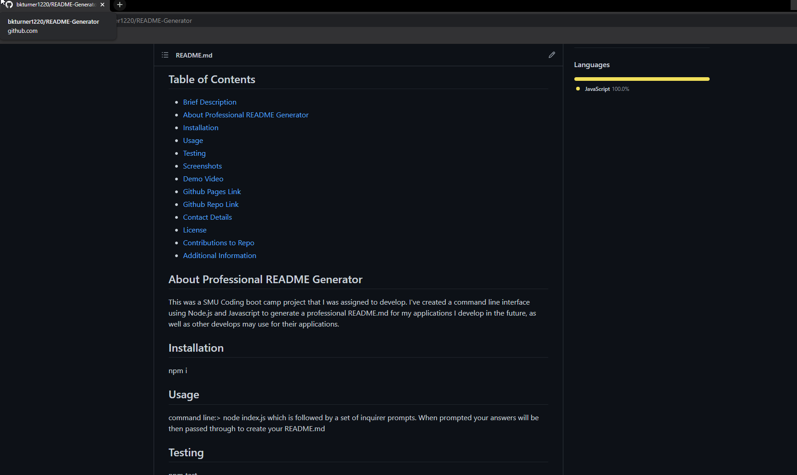

# Professional README Generator 

## Brief Description 📖
   A command line input interface to generate a profession README for applications.

## Table of Contents 💡
   * [Brief Description](#description)
   * [About Professional README Generator](#about)
   * [Installation](#install)
   * [Usage](#usage)
   * [Testing](#test)
   * [Screenshots](#screenshots)
   * [Demo Video](#demo)
   * [Github Pages Link](#pages) 
   * [Github Repo Link](#repo)
   * [Contact Details](#contact)
   * [License](#license)
   * [Contributions to Repo](#contributions)
   * [Additional Information](#info)

## About Professional README Generator 
   This was a SMU Coding boot camp project that I was assigned to develop. I've created a command line interface using Node.js and Javascript to generate a professional README.md for my applications I develop in the future, as well as other develops may use for their applications.
   
## Installation 🏗️
   npm i
 
## Usage 📝
   command line:> node index.js which is followed by a set of inquirer prompts. When prompted your answers will be then passed through to create your README.md   
      
## Testing 
   npm test

## Screenshots 📷
   
   
## Demo Video 
   
        
## Github Pages Link 
   <a href="https://bkturner1220.github.io/README-Generator" target="_blank">https://bkturner1220.github.io/README-Generator</a>
   
## Github Repo Link 
   <a href="https://github.com/bkturner1220/README-Generator" target="_blank">https://github.com/bkturner1220/README-Generator</a>
     
## Contact Information 
   Github Username: [bkturner1220](https://github.com/bkturner1220/) 
   Github: <a href="https://github.com/bkturner1220/">https://github.com/bkturner1220/</a> 
   Email: <a href="mailto:bturner@texascdlprep.com">bturner@texascdlprep.com</a>
   
## License Information 
 
   The application is covered under MIT license.
   
## Contributions towards Professional README Generator 🏆
   SMU Coding Boot Camp / Inquirer / Central Grader for SMU Coding Boot Camp
         
## Additional Information 
   If you encounter any problems, please feel free to reach out to me by sending me a [Email] to <a href="mailto:bturner@texascdlprep.com">bturner@texascdlprep.com</a>.
